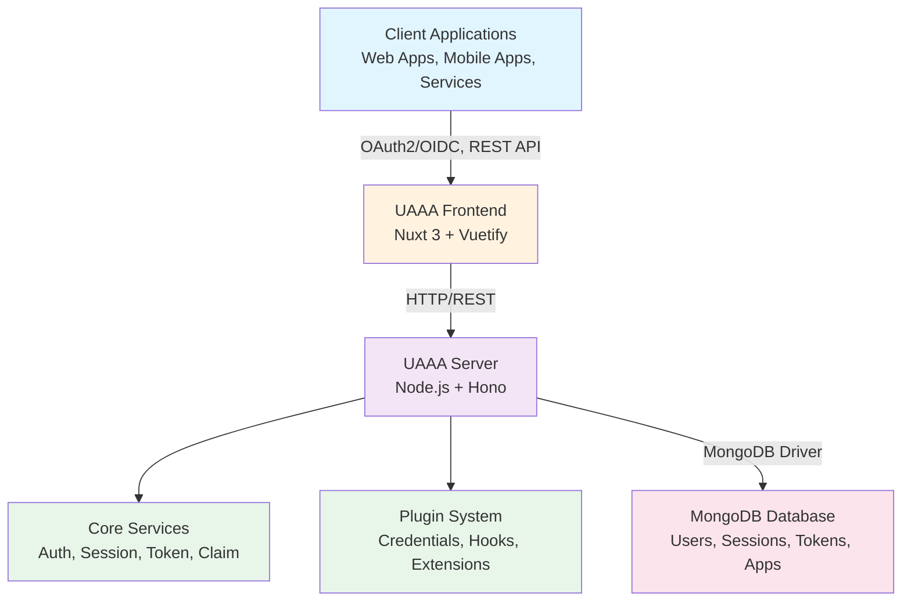
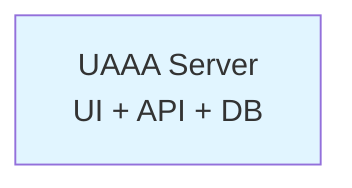
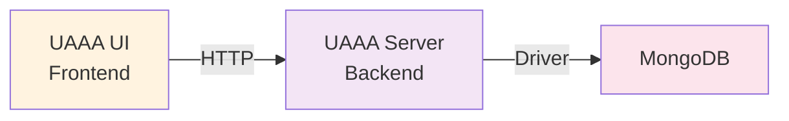
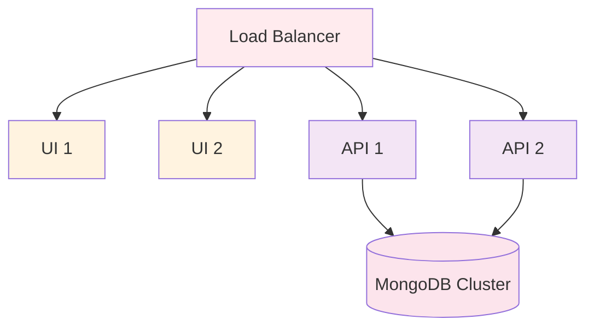

# Architecture

UAAA is designed as a modern, scalable authentication and authorization platform. This document provides a comprehensive overview of its architecture, components, and design principles.

## System Overview

UAAA follows a layered architecture with clear separation of concerns:



## Monorepo Structure

UAAA is organized as a monorepo with Yarn workspaces:

```
uaaa/
├── packages/
│   ├── core/          # Shared types and utilities
│   ├── server/        # Backend service
│   ├── ui/            # Frontend application
│   └── proxy/         # Reverse proxy
└── docs/              # Documentation
```

### @uaaa/core

Core package containing shared types, constants, and utilities used across all packages.

**Key Exports:**
- Type definitions for tokens, users, sessions
- Constants for security levels, credential types
- Utility functions for validation and formatting

### @uaaa/server

Backend service implementing all authentication and authorization logic.

**Architecture:**
```
src/
├── app.ts              # Application setup and initialization
├── cli/                # Command-line interface
├── routes/             # HTTP route handlers
│   ├── auth/           # Authentication endpoints
│   ├── oauth/          # OAuth2/OIDC endpoints
│   ├── api/            # REST API endpoints
│   └── admin/          # Admin endpoints
├── services/           # Business logic services
│   ├── auth.ts         # Authentication service
│   ├── session.ts      # Session management
│   ├── token.ts        # Token generation/validation
│   ├── claim.ts        # User claims management
│   └── permission.ts   # Permission checking
├── credential/         # Credential implementations
│   ├── password.ts     # Password authentication
│   ├── email.ts        # Email OTP
│   ├── sms.ts          # SMS OTP
│   ├── totp.ts         # Time-based OTP
│   └── webauthn.ts     # WebAuthn/FIDO2
├── plugin/             # Plugin system
│   ├── _common.ts      # Plugin interfaces
│   └── builtin/        # Built-in plugins
├── db/                 # Database layer
│   └── index.ts        # MongoDB collections
└── middleware/         # HTTP middleware
    ├── auth.ts         # JWT verification
    ├── cors.ts         # CORS handling
    └── error.ts        # Error handling
```

**Technology Stack:**
- **Hono**: Lightweight web framework
- **MongoDB**: Document database with native driver
- **ArkType**: Runtime type validation
- **JWT**: JSON Web Tokens via jose library
- **bcrypt**: Password hashing
- **@simplewebauthn**: WebAuthn implementation
- **Clipanion**: CLI framework
- **Pino**: Structured logging

### @uaaa/ui

Frontend application providing user interfaces for authentication and account management.

**Architecture:**
```
src/
├── pages/              # Nuxt pages (routes)
│   ├── auth/           # Authentication flows
│   │   ├── login.vue   # Login page
│   │   ├── signin.vue  # Sign-in with credentials
│   │   └── oauth.vue   # OAuth authorization
│   ├── account/        # Account management
│   └── admin/          # Admin interface
├── components/         # Vue components
│   ├── credential/     # Credential UI components
│   └── common/         # Shared components
├── composables/        # Vue composables
│   ├── useAuth.ts      # Authentication logic
│   └── useApi.ts       # API client
└── layouts/            # Page layouts
```

**Technology Stack:**
- **Nuxt 3**: Vue meta-framework with SSR
- **Vue 3**: Progressive JavaScript framework
- **Vuetify**: Material Design component framework
- **UnoCSS**: Utility-first CSS engine
- **Vite**: Fast build tool

### @uaaa/proxy

Reverse proxy for integrated deployments, serving both frontend and backend from a single domain.

## Core Concepts

### Security Levels

UAAA implements a five-tier security level system:

| Level | Name | Description | Typical Use |
|-------|------|-------------|-------------|
| 0 | HINT | Session lasting, user presence undetermined | Limited read operations |
| 1 | LOW | User likely present, identity not ensured | Low-privilege operations |
| 2 | MEDIUM | User present, weak credentials acceptable | Password, Email OTP, in-session operations |
| 3 | HIGH | User present and identity ensured | WebAuthn, TOTP, SMS OTP, cross-session operations |
| 4 | MAX | Authenticated with trusted credentials | Admin operations, console access |

**Key Features:**
- **Progressive**: Users can upgrade their level during a session
- **Flexible**: Each operation can require a specific level
- **Timeout-based**: Different levels have different session timeouts
- **Non-downgradable**: Cannot reduce level without new authentication

### Token System

UAAA uses two types of JWT tokens:

#### 1. Session Tokens

Issued when users authenticate to UAAA itself.

**Characteristics:**
- **Upgradeable**: Level can increase during session
- **Issuer**: UAAA server
- **Audience**: UAAA application ID
- **Purpose**: Access UAAA features and manage account

**Claims:**
```typescript
{
  iss: "https://auth.example.com",  // Issuer (UAAA server URL)
  sub: "user_abc123",               // User ID
  aud: "uaaa",                      // Audience (UAAA)
  client_id: "uaaa",                // Client ID
  sid: "session_xyz789",            // Session ID
  jti: "token_unique_id",           // Token ID
  perm: ["/session", "/user/**"],   // Scoped permissions (UAAA-specific)
  level: 2,                         // Security level (UAAA-specific)
  exp: 1700000000,                  // Expiration
  iat: 1699999000                   // Issued at
}
```

**UAAA-Specific Claims:**
- `perm`: Array of scoped permission strings starting with `/` (not standard OAuth2)
- `level`: Security level 0-4 (HINT/LOW/MEDIUM/HIGH/MAX)
- `sid`: Session ID for tracking

#### 2. App Tokens

Issued when users authorize client applications via OAuth2.

**Characteristics:**
- **Fixed level**: Level determined at issuance, cannot upgrade
- **Issuer**: UAAA server
- **Audience**: Target application ID
- **Purpose**: Access application resources

**Claims:**
```typescript
{
  iss: "https://auth.example.com",  // Issuer (UAAA server URL)
  sub: "user_abc123",               // User ID
  aud: "app.example.com",           // Target application
  client_id: "app.example.com",     // Client ID
  sid: "app_session_xyz",           // App-specific session
  jti: "token_unique_id",           // Token ID
  perm: ["/api/read", "/api/write"], // Scoped permissions (UAAA-specific)
  level: 2,                         // Security level (UAAA-specific)
  exp: 1700000000,                  // Expiration
  iat: 1699999000                   // Issued at
}
```

**UAAA-Specific Claims:**
- `perm`: Array of scoped permission strings (filtered for target app)
- `level`: Fixed security level determined at token creation
- `sid`: Session ID linking to parent session

### Credential System

Credentials are pluggable authentication methods that implement a common interface.

**Base Interface:**
```typescript
abstract class CredentialImpl {
  abstract type: CredentialType

  // Show availability for different contexts
  showLogin(): Promise<ICredentialLoginInfo | null>
  showVerify(): Promise<ICredentialVerifyInfo | null>
  showBind(): Promise<ICredentialBindInfo | null>

  // Execute authentication operations
  login?(payload): Promise<ICredentialLoginResult>
  verify(payload): Promise<ICredentialVerifyResult>
  bind(payload): Promise<ICredentialBindResult>
  unbind(payload): Promise<ICredentialUnbindResult>

  // Optional: auto-provision users
  ensure?(payload): Promise<ICredentialEnsureResult>
}
```

**Built-in Credentials:**

1. **Password**
   - Security Level: MEDIUM (2)
   - Storage: bcrypt hashed
   - Global Identifier: Username

2. **Email OTP**
   - Security Level: MEDIUM (2)
   - Delivery: SMTP
   - Validity: Configurable (default: 10 minutes)

3. **SMS OTP**
   - Security Level: HIGH (3)
   - Delivery: External gateway
   - Validity: Configurable (default: 10 minutes)

4. **TOTP (Time-based OTP)**
   - Security Level: HIGH (3, configurable)
   - Algorithm: HMAC-SHA1
   - Window: 30 seconds

5. **WebAuthn**
   - Security Level: HIGH (3)
   - Standard: FIDO2/WebAuthn
   - Attestation: Optional

### Claims System

Claims are verified attributes associated with users.

**Standard Claims:**
- `username`: Unique username
- `realname`: Real name
- `email`: Email address
- `phone`: Phone number
- `avatar`: Avatar URL

**Claim Structure:**
```typescript
{
  value: string,          // Claim value
  verified: boolean       // Verification status
}
```

**Claim Descriptors:**
```typescript
{
  name: "realname",
  description: "User's real name",
  securityLevel: SECURITY_LEVEL.LOW,
  editable: true,         // Can user edit?
  hidden: false,          // Hide from UI?
  basic: true,            // Include in basic profile?
  openid: {               // OpenID Connect mapping
    alias: "name",
    verifiable: true
  }
}
```

**Plugin Claims:**

Plugins can register custom claims with a namespace:
```
plugin_name:claim_name
```

Example: `iaaa:identity_id`, `iaaa:dept`

### Permission System

Permissions use a URL-based hierarchical format:

**Format:**
```
app_id/resource/action
```

**Examples:**
```
uaaa/session/read              # Read own session
uaaa/user/*/claim/write        # Write any user's claims (admin)
app.example.com/api/read       # Read app API
app.example.com/**             # All app resources
```

**Wildcards:**
- `*`: Single level wildcard
- `**`: Multi-level wildcard (must be at end)

**Permission Checking:**
```typescript
// User has: ["uaaa/user/*/claim/write"]
// Checking: "uaaa/user/abc123/claim/write"
// Result: ✓ Match

// User has: ["app.example.com/**"]
// Checking: "app.example.com/api/admin/delete"
// Result: ✓ Match
```

### Session Management

Sessions track user authentication state and security level.

**Session Document:**
```typescript
{
  _id: "session_id",
  userId: "user_id",
  securityLevel: 1,
  levelUpgradedAt: [
    1699999000,  // Level 0 timestamp
    1699999100,  // Level 1 timestamp
  ],
  data: {
    // Session-specific data
  },
  validAfter: 1699999000,
  validBefore: 1700000000,
  createdAt: 1699999000,
  updatedAt: 1699999100
}
```

**Session Lifecycle:**

1. **Creation**: User authenticates with any credential
2. **Upgrade**: User verifies with higher-level credential
3. **Timeout**: Session expires based on level configuration
4. **Revocation**: Manual logout or admin action

**Timeout Configuration:**
```typescript
{
  "sessionTimeout": [
    600,      // Level 0: 10 minutes
    1800,     // Level 1: 30 minutes
    3600,     // Level 2: 1 hour
    7200      // Level 3: 2 hours
  ]
}
```

## Database Schema

UAAA uses MongoDB with the following collections:

### users

Stores user accounts and claims.

```typescript
{
  _id: string,              // User ID (nanoid)
  claims: {
    username: {
      value: string,
      verified: boolean
    },
    realname?: {
      value: string,
      verified: boolean
    },
    email?: {
      value: string,
      verified: boolean
    },
    // ... other claims
  },
  salt: string,             // Random salt (nanoid)
  createdAt: number,        // Unix timestamp
  updatedAt: number         // Unix timestamp
}
```

**Indexes:**
- `claims.username.value` (unique)
- `claims.email.value` (sparse, unique)

### credentials

Stores authentication credentials.

```typescript
{
  _id: string,                   // Credential ID
  userId: string,                // Owner user ID
  type: CredentialType,          // password, email, etc.
  globalIdentifier?: string,     // Unique per type
  userIdentifier?: string,       // Display identifier
  data: string,                  // Credential-specific data
  secret: string,                // Encrypted secret
  remark: string,                // User note
  securityLevel: SecurityLevel,  // Minimum level
  validAfter: number,            // Valid from
  validBefore: number,           // Valid until
  validCount: number,            // Remaining uses
  createdAt: number,
  updatedAt: number,
  lastAccessedAt?: number,
  accessedCount?: number,
  disabled?: boolean
}
```

**Indexes:**
- `userId`
- `type, globalIdentifier` (unique, sparse)

### sessions

Stores active user sessions.

```typescript
{
  _id: string,              // Session ID
  userId: string,           // User ID
  securityLevel: number,    // Current level
  levelUpgradedAt: number[], // Timestamps per level
  data: object,             // Session data
  validAfter: number,
  validBefore: number,
  createdAt: number,
  updatedAt: number
}
```

**Indexes:**
- `userId`
- `validBefore` (TTL index)

### tokens

Stores issued tokens for revocation tracking.

```typescript
{
  _id: string,              // Token ID (jti)
  sessionId: string,        // Associated session
  userId: string,           // Token owner
  appId: string,            // Target application
  securityLevel: number,    // Token level
  permissions: string[],    // Granted permissions
  validAfter: number,
  validBefore: number,
  createdAt: number
}
```

**Indexes:**
- `sessionId`
- `userId`
- `validBefore` (TTL index)

### apps

Stores registered client applications.

```typescript
{
  _id: string,                   // App ID
  name: string,                  // Display name
  description: string,           // Description
  redirectUris: string[],        // OAuth redirect URIs
  icon?: string,                 // App icon URL
  defaultPermissions: string[],  // Default permissions
  owner: string,                 // Owner user ID
  createdAt: number,
  updatedAt: number
}
```

**Indexes:**
- `owner`

### invitations

Stores user invitation codes.

```typescript
{
  _id: string,              // Invitation code
  creator: string,          // Creator user ID
  claims: object,           // Pre-filled claims
  permissions: string[],    // Granted permissions
  validAfter: number,
  validBefore: number,
  maxUses: number,          // Max redemptions
  usedCount: number,        // Current usage
  createdAt: number
}
```

**Indexes:**
- `creator`
- `validBefore` (TTL index)

### oauth_codes

Stores OAuth authorization codes (short-lived).

```typescript
{
  _id: string,               // Authorization code
  userId: string,            // User ID
  appId: string,             // Client app ID
  redirectUri: string,       // Redirect URI
  scope: string[],           // Requested scopes
  codeChallenge?: string,    // PKCE challenge
  codeChallengeMethod?: string, // PKCE method
  validBefore: number,       // Expiration
  createdAt: number
}
```

**Indexes:**
- `validBefore` (TTL index)

### device_codes

Stores OAuth device flow codes.

```typescript
{
  _id: string,              // Device code
  userCode: string,         // User-friendly code
  appId: string,            // Client app ID
  scope: string[],          // Requested scopes
  userId?: string,          // Authorized user
  status: string,           // pending, authorized, denied
  validBefore: number,
  createdAt: number,
  lastPolled?: number
}
```

**Indexes:**
- `userCode` (unique)
- `validBefore` (TTL index)

## Plugin System

The plugin system allows extending UAAA with custom functionality.

### Plugin Interface

```typescript
interface IPlugin {
  name: string,
  version: string,
  description?: string,
  license?: string,
  author?: string,
  configType?: ArkType,      // Configuration schema
  setup(ctx: PluginContext): void | Cleanup | Promise<void | Cleanup>
}
```

### Plugin Context

```typescript
interface PluginContext {
  app: App,                  // Access to app instance
  logger: Logger,            // Plugin-specific logger
  config: IConfig            // Application configuration
}
```

### Plugin Lifecycle

1. **Load**: Plugin module imported and validated
2. **Config Validation**: Plugin config validated against schema
3. **Setup**: Plugin `setup()` function called
4. **Ready**: Plugin registered and available
5. **Cleanup**: Optional cleanup function called on shutdown

### Plugin Hooks

Plugins can hook into various application events:

```typescript
// HTTP routes
app.hook('extendApp', (router) => {
  router.get('/api/plugin/myplugin/data', handler)
})

// Credential registration
app.credential.provide(new MyCredentialImpl(app))

// Claim registration
app.claim.addClaimDescriptor({
  name: 'myplugin:custom_claim',
  description: 'Custom claim',
  securityLevel: SECURITY_LEVEL.LOW
})
```

### Plugin Resolution

Plugins are resolved in the following order:

1. Exact package name: `@org/plugin-name`
2. Local path: `/path/to/plugin`
3. Shorthand: `name` → `@uaaa/plugin-name`
4. Built-in: `builtin/name`

## OAuth2 & OpenID Connect

UAAA implements OAuth 2.0 and OpenID Connect with the following features:

### Supported Flows

1. **Authorization Code Flow with PKCE**
   - RFC 6749 + RFC 7636
   - Recommended for web and mobile apps

2. **Refresh Token Flow**
   - RFC 6749 Section 6
   - Long-lived sessions

3. **Device Authorization Flow**
   - RFC 8628
   - For devices without browsers

### Discovery Endpoint

```
GET /.well-known/openid-configuration
```

Returns OpenID Connect discovery document with:
- `issuer`: UAAA server URL
- `authorization_endpoint`: OAuth authorization URL
- `token_endpoint`: Token exchange URL
- `userinfo_endpoint`: UserInfo endpoint
- `jwks_uri`: JSON Web Key Set URL
- `scopes_supported`: Available scopes
- `response_types_supported`: Supported response types
- `grant_types_supported`: Supported grant types
- `code_challenge_methods_supported`: PKCE methods

### Scopes

UAAA maps permissions to OAuth scopes:

**OpenID Scopes:**
- `openid`: OpenID Connect ID token
- `profile`: Basic profile (name, username)
- `email`: Email address
- `phone`: Phone number

**Permission Scopes:**
- `uperm://app.example.com/api/read`: Required permission
- `uperm+optional://app.example.com/admin`: Optional permission

**Upgradability:**
- `upgradable`: Session token (can upgrade level)
- Default: App token (fixed level)

### Endpoints

#### Authorization
```
GET /oauth/authorize
  ?client_id=app_id
  &response_type=code
  &redirect_uri=https://app.example.com/callback
  &scope=openid profile uperm://app_id/**
  &state=random_state
  &code_challenge=challenge
  &code_challenge_method=S256
```

#### Token Exchange
```
POST /oauth/token
Content-Type: application/x-www-form-urlencoded

grant_type=authorization_code
&code=auth_code
&redirect_uri=https://app.example.com/callback
&client_id=app_id
&code_verifier=verifier
```

#### Token Refresh
```
POST /oauth/token
Content-Type: application/x-www-form-urlencoded

grant_type=refresh_token
&refresh_token=refresh_token_value
&client_id=app_id
```

#### UserInfo
```
GET /oauth/userinfo
Authorization: Bearer access_token
```

#### Device Flow
```
POST /oauth/device/code
Content-Type: application/x-www-form-urlencoded

client_id=app_id
&scope=openid profile
```

## API Endpoints

### Authentication

| Method | Path | Description |
|--------|------|-------------|
| POST | `/auth/login` | Initiate login with credential |
| POST | `/auth/verify` | Verify credential and upgrade level |
| POST | `/auth/logout` | Terminate session |
| GET | `/auth/session` | Get current session info |

### Session Management

| Method | Path | Description |
|--------|------|-------------|
| GET | `/api/session` | List user sessions |
| DELETE | `/api/session/:id` | Revoke specific session |
| DELETE | `/api/session` | Revoke all sessions |

### User Management

| Method | Path | Description |
|--------|------|-------------|
| GET | `/api/user` | Get current user profile |
| PATCH | `/api/user/claim` | Update user claims |
| GET | `/api/user/credential` | List credentials |
| POST | `/api/user/credential` | Bind new credential |
| DELETE | `/api/user/credential/:id` | Unbind credential |

### Application Management

| Method | Path | Description |
|--------|------|-------------|
| GET | `/api/app` | List registered apps |
| POST | `/api/app` | Register new app |
| GET | `/api/app/:id` | Get app details |
| PATCH | `/api/app/:id` | Update app |
| DELETE | `/api/app/:id` | Delete app |

### Token Management

| Method | Path | Description |
|--------|------|-------------|
| GET | `/api/token` | List issued tokens |
| POST | `/api/token/upgrade` | Upgrade session level |
| POST | `/api/token/app` | Request app token |
| DELETE | `/api/token/:id` | Revoke token |

## Security Considerations

### Token Security

- **Short-lived**: Access tokens expire quickly (configurable)
- **Rotation**: Refresh tokens rotate on use
- **Revocation**: Tokens can be revoked immediately
- **Validation**: All tokens validated against database

### Password Security

- **Hashing**: bcrypt with configurable cost factor
- **Salting**: Unique user salt + credential salt
- **Rate Limiting**: Failed login attempt throttling
- **Complexity**: Configurable password requirements

### Session Security

- **Secure Cookies**: HttpOnly, Secure, SameSite
- **CSRF Protection**: State parameters in OAuth flows
- **Timeout**: Configurable per security level
- **Binding**: Optional IP address binding

### Transport Security

- **HTTPS**: TLS 1.2+ required in production
- **HSTS**: Strict-Transport-Security header
- **Certificate Validation**: Proper certificate chain validation

## Deployment Architecture

### Single Server



Simple deployment for small-scale use.

### Separated Services



Separate frontend and backend for scalability.

### Load Balanced



High availability with load balancing.

## Performance Characteristics

### Token Operations

- **Generation**: ~10ms (JWT signing)
- **Validation**: ~5ms (JWT verification)
- **Refresh**: ~50ms (database update + signing)

### Authentication

- **Password**: ~100ms (bcrypt verification)
- **Email OTP**: ~200ms (SMTP send + database)
- **TOTP**: ~10ms (HMAC calculation)
- **WebAuthn**: ~500ms (cryptographic verification)

### Database Queries

- **User lookup**: ~5ms (indexed)
- **Session read**: ~5ms (indexed)
- **Credential verify**: ~10ms (indexed + decrypt)

## Scalability

- **Horizontal**: Stateless API servers can scale horizontally
- **Sessions**: MongoDB-backed sessions work across instances
- **Caching**: Optional Redis for token validation caching
- **Database**: MongoDB supports sharding for large deployments

## Next Steps

- **[Deployment](./deployment)**: Deploy UAAA to production
- **[Configuration](./configuration)**: Configure UAAA settings
- **[Plugin Development](./plugins/developing-plugins)**: Create custom plugins
- **[OAuth2 Guide](./oauth2)**: Implement OAuth2 integration
