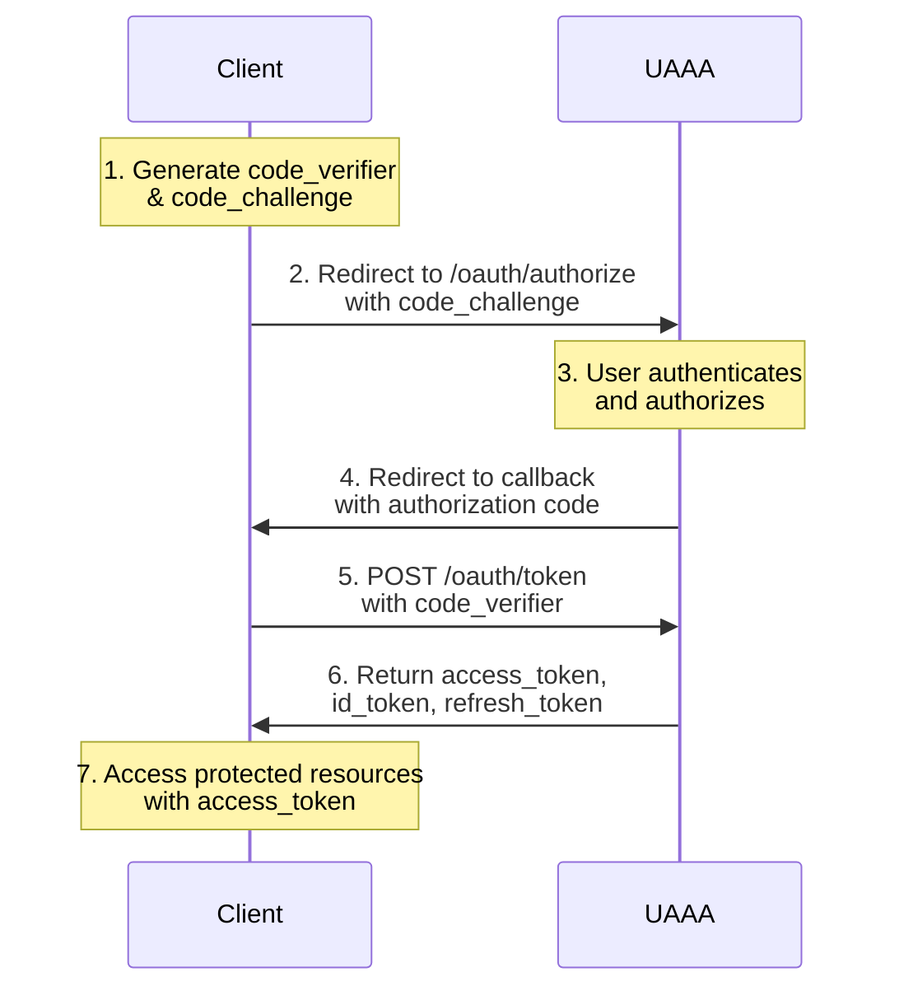

# OAuth2 and OIDC Integration

This guide demonstrates how to integrate your application with UAAA using standard OAuth 2.0 and OpenID Connect protocols.

## Overview

UAAA implements:
- **OAuth 2.0**: Authorization framework (RFC 6749)
- **PKCE**: Proof Key for Code Exchange (RFC 7636)
- **OpenID Connect**: Identity layer on OAuth 2.0
- **Discovery**: Automatic configuration discovery

## Prerequisites

### 1. Register Your Application

```bash
curl -X POST https://auth.example.com/api/app \
  -H "Authorization: Bearer <admin_token>" \
  -H "Content-Type: application/json" \
  -d '{
    "_id": "myapp.example.com",
    "name": "My Application",
    "description": "My awesome app",
    "redirectUris": [
      "https://myapp.example.com/auth/callback",
      "https://myapp.example.com/auth/silent-refresh"
    ],
    "defaultPermissions": ["myapp.example.com/**"]
  }'
```

### 2. Discover OpenID Configuration

```bash
curl https://auth.example.com/.well-known/openid-configuration
```

Response:
```json
{
  "issuer": "https://auth.example.com",
  "authorization_endpoint": "https://auth.example.com/oauth/authorize",
  "token_endpoint": "https://auth.example.com/oauth/token",
  "userinfo_endpoint": "https://auth.example.com/oauth/userinfo",
  "jwks_uri": "https://auth.example.com/.well-known/jwks.json",
  "scopes_supported": [
    "openid",
    "profile",
    "email",
    "phone",
    "uperm://**"
  ],
  "response_types_supported": ["code"],
  "grant_types_supported": [
    "authorization_code",
    "refresh_token",
    "urn:ietf:params:oauth:grant-type:device_code"
  ],
  "code_challenge_methods_supported": ["S256"],
  "token_endpoint_auth_methods_supported": ["none"],
  "subject_types_supported": ["public"]
}
```

## Integration Flow

### Authorization Code Flow with PKCE



## Implementation Examples

### Node.js / Express

```javascript
const express = require('express')
const crypto = require('crypto')
const session = require('express-session')
const axios = require('axios')

const app = express()

app.use(session({
  secret: 'session-secret',
  resave: false,
  saveUninitialized: false
}))

const config = {
  clientId: 'myapp.example.com',
  authorizationEndpoint: 'https://auth.example.com/oauth/authorize',
  tokenEndpoint: 'https://auth.example.com/oauth/token',
  userInfoEndpoint: 'https://auth.example.com/oauth/userinfo',
  redirectUri: 'https://myapp.example.com/auth/callback',
  scopes: ['openid', 'profile', 'email', 'uperm://myapp.example.com/**']
}

// Generate PKCE challenge
function generatePKCE() {
  const verifier = crypto.randomBytes(32).toString('base64url')
  const challenge = crypto
    .createHash('sha256')
    .update(verifier)
    .digest('base64url')
  return { verifier, challenge }
}

// Login route
app.get('/auth/login', (req, res) => {
  const pkce = generatePKCE()
  const state = crypto.randomBytes(16).toString('hex')

  // Store PKCE verifier and state in session
  req.session.pkceVerifier = pkce.verifier
  req.session.oauthState = state

  const params = new URLSearchParams({
    client_id: config.clientId,
    response_type: 'code',
    redirect_uri: config.redirectUri,
    scope: config.scopes.join(' '),
    state: state,
    code_challenge: pkce.challenge,
    code_challenge_method: 'S256'
  })

  res.redirect(`${config.authorizationEndpoint}?${params}`)
})

// Callback route
app.get('/auth/callback', async (req, res) => {
  const { code, state } = req.query

  // Verify state
  if (state !== req.session.oauthState) {
    return res.status(400).send('Invalid state')
  }

  try {
    // Exchange code for tokens
    const tokenResponse = await axios.post(
      config.tokenEndpoint,
      new URLSearchParams({
        grant_type: 'authorization_code',
        code: code,
        redirect_uri: config.redirectUri,
        client_id: config.clientId,
        code_verifier: req.session.pkceVerifier
      }),
      {
        headers: { 'Content-Type': 'application/x-www-form-urlencoded' }
      }
    )

    const { access_token, id_token, refresh_token } = tokenResponse.data

    // Store tokens in session
    req.session.accessToken = access_token
    req.session.idToken = id_token
    req.session.refreshToken = refresh_token

    // Clean up PKCE data
    delete req.session.pkceVerifier
    delete req.session.oauthState

    res.redirect('/dashboard')
  } catch (error) {
    console.error('Token exchange error:', error.response?.data || error.message)
    res.status(500).send('Authentication failed')
  }
})

// Protected route
app.get('/dashboard', async (req, res) => {
  if (!req.session.accessToken) {
    return res.redirect('/auth/login')
  }

  try {
    // Fetch user info
    const userInfo = await axios.get(config.userInfoEndpoint, {
      headers: { Authorization: `Bearer ${req.session.accessToken}` }
    })

    res.json({
      message: 'Welcome!',
      user: userInfo.data
    })
  } catch (error) {
    // Token expired or invalid
    if (error.response?.status === 401) {
      return res.redirect('/auth/login')
    }
    res.status(500).send('Error fetching user info')
  }
})

// API endpoint
app.get('/api/data', async (req, res) => {
  if (!req.session.accessToken) {
    return res.status(401).json({ error: 'Unauthorized' })
  }

  // Use access token to call protected API
  res.json({ data: 'Protected data', user: req.session.userId })
})

// Logout
app.get('/auth/logout', (req, res) => {
  const idToken = req.session.idToken

  req.session.destroy(() => {
    // Redirect to UAAA logout
    res.redirect(
      `https://auth.example.com/oauth/logout?` +
      `id_token_hint=${idToken}&` +
      `post_logout_redirect_uri=https://myapp.example.com`
    )
  })
})

app.listen(3000, () => {
  console.log('App listening on http://localhost:3000')
})
```

### Python / Flask

```python
from flask import Flask, redirect, request, session, url_for
import requests
import secrets
import hashlib
import base64

app = Flask(__name__)
app.secret_key = 'your-secret-key'

CONFIG = {
    'client_id': 'myapp.example.com',
    'authorization_endpoint': 'https://auth.example.com/oauth/authorize',
    'token_endpoint': 'https://auth.example.com/oauth/token',
    'userinfo_endpoint': 'https://auth.example.com/oauth/userinfo',
    'redirect_uri': 'https://myapp.example.com/auth/callback',
    'scopes': ['openid', 'profile', 'email', 'uperm://myapp.example.com/**']
}

def generate_pkce():
    """Generate PKCE code verifier and challenge"""
    verifier = base64.urlsafe_b64encode(secrets.token_bytes(32)).decode('utf-8').rstrip('=')
    challenge = base64.urlsafe_b64encode(
        hashlib.sha256(verifier.encode()).digest()
    ).decode('utf-8').rstrip('=')
    return verifier, challenge

@app.route('/auth/login')
def login():
    verifier, challenge = generate_pkce()
    state = secrets.token_hex(16)

    session['pkce_verifier'] = verifier
    session['oauth_state'] = state

    params = {
        'client_id': CONFIG['client_id'],
        'response_type': 'code',
        'redirect_uri': CONFIG['redirect_uri'],
        'scope': ' '.join(CONFIG['scopes']),
        'state': state,
        'code_challenge': challenge,
        'code_challenge_method': 'S256'
    }

    auth_url = f"{CONFIG['authorization_endpoint']}?{requests.compat.urlencode(params)}"
    return redirect(auth_url)

@app.route('/auth/callback')
def callback():
    code = request.args.get('code')
    state = request.args.get('state')

    if state != session.get('oauth_state'):
        return 'Invalid state', 400

    # Exchange code for tokens
    token_response = requests.post(
        CONFIG['token_endpoint'],
        data={
            'grant_type': 'authorization_code',
            'code': code,
            'redirect_uri': CONFIG['redirect_uri'],
            'client_id': CONFIG['client_id'],
            'code_verifier': session.get('pkce_verifier')
        },
        headers={'Content-Type': 'application/x-www-form-urlencoded'}
    )

    if token_response.status_code != 200:
        return 'Token exchange failed', 500

    tokens = token_response.json()
    session['access_token'] = tokens['access_token']
    session['id_token'] = tokens['id_token']
    session['refresh_token'] = tokens.get('refresh_token')

    # Clean up
    session.pop('pkce_verifier', None)
    session.pop('oauth_state', None)

    return redirect('/dashboard')

@app.route('/dashboard')
def dashboard():
    if 'access_token' not in session:
        return redirect(url_for('login'))

    # Fetch user info
    user_response = requests.get(
        CONFIG['userinfo_endpoint'],
        headers={'Authorization': f"Bearer {session['access_token']}"}
    )

    if user_response.status_code != 200:
        return redirect(url_for('login'))

    user = user_response.json()
    return f"<h1>Welcome {user.get('name', 'User')}</h1><p>Email: {user.get('email')}</p>"

@app.route('/auth/logout')
def logout():
    id_token = session.get('id_token')
    session.clear()

    logout_url = (
        f"https://auth.example.com/oauth/logout?"
        f"id_token_hint={id_token}&"
        f"post_logout_redirect_uri=https://myapp.example.com"
    )
    return redirect(logout_url)

if __name__ == '__main__':
    app.run(debug=True, port=3000)
```

### React / SPA

```typescript
// src/auth/AuthProvider.tsx
import React, { createContext, useContext, useState, useEffect } from 'react'
import axios from 'axios'

const CONFIG = {
  clientId: 'myapp.example.com',
  authorizationEndpoint: 'https://auth.example.com/oauth/authorize',
  tokenEndpoint: 'https://auth.example.com/oauth/token',
  userInfoEndpoint: 'https://auth.example.com/oauth/userinfo',
  redirectUri: 'https://myapp.example.com/auth/callback',
  scopes: ['openid', 'profile', 'email', 'uperm://myapp.example.com/**']
}

interface AuthContextType {
  isAuthenticated: boolean
  user: any
  login: () => void
  logout: () => void
  getAccessToken: () => string | null
}

const AuthContext = createContext<AuthContextType | null>(null)

export function AuthProvider({ children }: { children: React.ReactNode }) {
  const [isAuthenticated, setIsAuthenticated] = useState(false)
  const [user, setUser] = useState(null)

  useEffect(() => {
    const token = localStorage.getItem('access_token')
    if (token) {
      fetchUserInfo(token)
    }
  }, [])

  async function fetchUserInfo(token: string) {
    try {
      const response = await axios.get(CONFIG.userInfoEndpoint, {
        headers: { Authorization: `Bearer ${token}` }
      })
      setUser(response.data)
      setIsAuthenticated(true)
    } catch (error) {
      localStorage.removeItem('access_token')
      localStorage.removeItem('refresh_token')
      setIsAuthenticated(false)
    }
  }

  function generatePKCE() {
    const randomBytes = new Uint8Array(32)
    crypto.getRandomValues(randomBytes)
    const verifier = btoa(String.fromCharCode(...randomBytes))
      .replace(/\+/g, '-')
      .replace(/\//g, '_')
      .replace(/=/g, '')

    const encoder = new TextEncoder()
    const data = encoder.encode(verifier)
    return crypto.subtle.digest('SHA-256', data).then((hash) => {
      const challenge = btoa(String.fromCharCode(...new Uint8Array(hash)))
        .replace(/\+/g, '-')
        .replace(/\//g, '_')
        .replace(/=/g, '')
      return { verifier, challenge }
    })
  }

  async function login() {
    const { verifier, challenge } = await generatePKCE()
    const state = Array.from(crypto.getRandomValues(new Uint8Array(16)))
      .map(b => b.toString(16).padStart(2, '0'))
      .join('')

    localStorage.setItem('pkce_verifier', verifier)
    localStorage.setItem('oauth_state', state)

    const params = new URLSearchParams({
      client_id: CONFIG.clientId,
      response_type: 'code',
      redirect_uri: CONFIG.redirectUri,
      scope: CONFIG.scopes.join(' '),
      state,
      code_challenge: challenge,
      code_challenge_method: 'S256'
    })

    window.location.href = `${CONFIG.authorizationEndpoint}?${params}`
  }

  function logout() {
    const idToken = localStorage.getItem('id_token')
    localStorage.removeItem('access_token')
    localStorage.removeItem('id_token')
    localStorage.removeItem('refresh_token')
    setIsAuthenticated(false)
    setUser(null)

    window.location.href = (
      `https://auth.example.com/oauth/logout?` +
      `id_token_hint=${idToken}&` +
      `post_logout_redirect_uri=${window.location.origin}`
    )
  }

  function getAccessToken() {
    return localStorage.getItem('access_token')
  }

  return (
    <AuthContext.Provider value={{ isAuthenticated, user, login, logout, getAccessToken }}>
      {children}
    </AuthContext.Provider>
  )
}

export function useAuth() {
  const context = useContext(AuthContext)
  if (!context) throw new Error('useAuth must be used within AuthProvider')
  return context
}

// src/auth/Callback.tsx
export function AuthCallback() {
  useEffect(() => {
    const params = new URLSearchParams(window.location.search)
    const code = params.get('code')
    const state = params.get('state')

    if (state !== localStorage.getItem('oauth_state')) {
      console.error('Invalid state')
      return
    }

    exchangeCodeForTokens(code!)
  }, [])

  async function exchangeCodeForTokens(code: string) {
    try {
      const response = await axios.post(
        CONFIG.tokenEndpoint,
        new URLSearchParams({
          grant_type: 'authorization_code',
          code,
          redirect_uri: CONFIG.redirectUri,
          client_id: CONFIG.clientId,
          code_verifier: localStorage.getItem('pkce_verifier')!
        }),
        { headers: { 'Content-Type': 'application/x-www-form-urlencoded' } }
      )

      const { access_token, id_token, refresh_token } = response.data

      localStorage.setItem('access_token', access_token)
      localStorage.setItem('id_token', id_token)
      if (refresh_token) localStorage.setItem('refresh_token', refresh_token)

      localStorage.removeItem('pkce_verifier')
      localStorage.removeItem('oauth_state')

      window.location.href = '/'
    } catch (error) {
      console.error('Token exchange failed', error)
    }
  }

  return <div>Completing authentication...</div>
}
```

## Token Refresh

```javascript
async function refreshAccessToken(refreshToken) {
  const response = await axios.post(
    'https://auth.example.com/oauth/token',
    new URLSearchParams({
      grant_type: 'refresh_token',
      refresh_token: refreshToken,
      client_id: 'myapp.example.com'
    }),
    { headers: { 'Content-Type': 'application/x-www-form-urlencoded' } }
  )

  return response.data
}
```

## Scopes

### OpenID Connect Scopes

- `openid`: Required for OIDC, includes ID token
- `profile`: Basic profile (name, username)
- `email`: Email address
- `phone`: Phone number

### Permission Scopes

- `uperm://myapp.example.com/**`: All app permissions
- `uperm://myapp.example.com/api/read`: Specific permission
- `uperm+optional://myapp.example.com/admin`: Optional permission

### Upgradability

- `upgradable`: Session token (can upgrade security level)
- Default: App token (fixed security level)

## Next Steps

- **[PreAuth Integration](./pre-auth)**: Silent authentication for external identity
- **[PreferType Integration](./prefer-type)**: Specify preferred credential type
