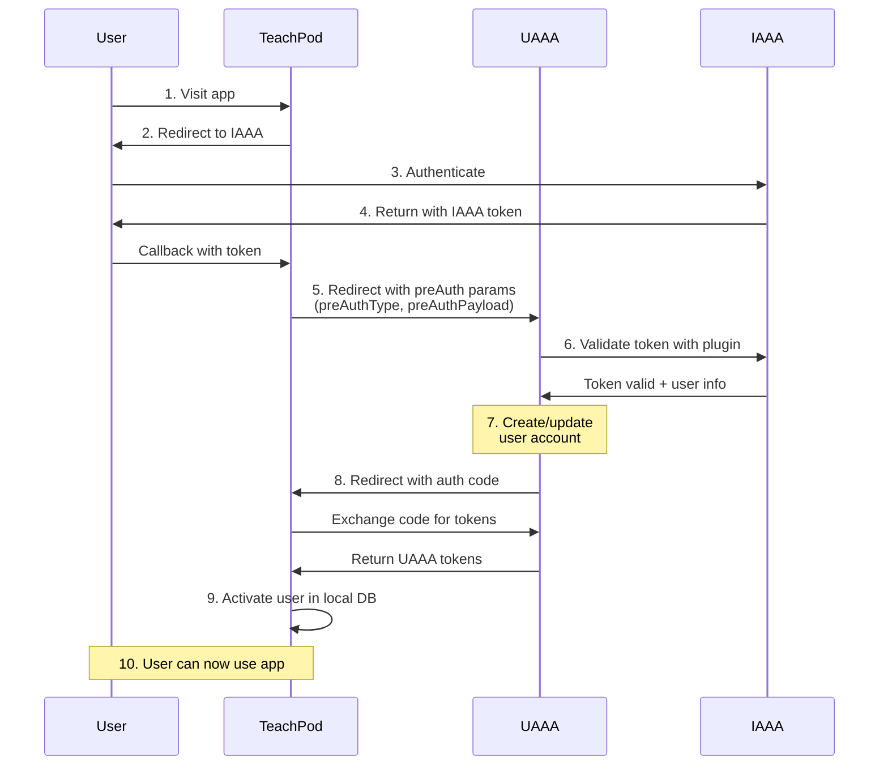

# PreAuth + NonInteractive Integration

This guide demonstrates how to integrate applications using pre-authentication and non-interactive mode, where UAAA's UI is invisible to end users.

## Overview

**PreAuth** allows bridging external authentication systems (like university SSO) to UAAA seamlessly. Users authenticate with the external system, and your application automatically provisions them in UAAA without showing login UI.

**Use Case**: TeachPod (PKU teaching platform) integrates IAAA (PKU's identity system) with UAAA invisibly.

## Flow Diagram



## Prerequisites

### 1. Plugin Configuration

Install and configure the IAAA plugin (or your external identity plugin):

```json
{
  "plugins": ["password", "totp", "@pku-uaaa/plugin-iaaa"],
  "iaaaConfig": {
    "id": "your-app-id",
    "name": "Your App",
    "key": "your-app-secret",
    "redirect": "https://yourapp.com/iaaa/callback"
  },
  "iaaaAllowSignup": true,
  "iaaaEndpoint": "https://iaaa.pku.edu.cn/iaaa/svc/token/validate.do"
}
```

### 2. Register UAAA Application

```json
{
  "_id": "yourapp.com",
  "name": "Your Application",
  "redirectUris": ["https://yourapp.com/auth/callback"],
  "defaultPermissions": ["yourapp.com/**"]
}
```

## Implementation: Node.js + Express

### Configuration

```javascript
// config.js
module.exports = {
  iaaa: {
    appId: process.env.IAAA_APP_ID,
    appName: 'YourApp',
    redirectUri: 'https://yourapp.com/iaaa/callback',
    authorizeUrl: 'https://iaaa.pku.edu.cn/iaaa/oauth.jsp'
  },
  uaaa: {
    issuer: 'https://auth.example.com',
    clientAppId: 'yourapp.com',
    authorizeUrl: 'https://auth.example.com/oauth/authorize',
    callbackUrl: 'https://yourapp.com/auth/callback'
  }
}
```

### Authentication Flow

```javascript
const express = require('express')
const session = require('express-session')
const axios = require('axios')
const config = require('./config')

const app = express()

app.use(session({
  secret: 'your-session-secret',
  resave: false,
  saveUninitialized: false
}))

// Step 1: Initial login - redirect to IAAA
app.get('/auth/login', (req, res) => {
  const redirectUrl = req.query.redirect || '/'
  req.session.postLoginRedirect = redirectUrl

  const params = new URLSearchParams({
    appID: config.iaaa.appId,
    appName: config.iaaa.appName,
    redirectUrl: config.iaaa.redirectUri
  })

  res.redirect(`${config.iaaa.authorizeUrl}?${params}`)
})

// Step 2: IAAA callback - receive token
app.get('/iaaa/callback', (req, res) => {
  const { token } = req.query

  if (!token) {
    return res.status(400).send('No IAAA token received')
  }

  // Store IAAA token temporarily
  req.session.iaaaToken = token

  // Redirect to UAAA with preAuth parameters encoded in scope
  const preAuthParams = {
    preAuthType: 'iaaa',
    preAuthPayload: JSON.stringify({ token: token }),
    nonInteractive: true
  }
  const encodedParams = Buffer.from(JSON.stringify(preAuthParams)).toString('base64')

  const uaaaParams = new URLSearchParams({
    client_id: config.uaaa.clientAppId,
    response_type: 'code',
    redirect_uri: config.uaaa.callbackUrl,
    scope: `openid profile uperm://${config.uaaa.clientAppId}/** uaaa+param://${encodedParams}`
  })

  res.redirect(`${config.uaaa.authorizeUrl}?${uaaaParams}`)
})

// Step 3: UAAA callback - receive authorization code
app.get('/auth/callback', async (req, res) => {
  const { code, error } = req.query

  if (error) {
    return res.status(400).send(`Authentication failed: ${error}`)
  }

  try {
    // Exchange code for access token
    const tokenResponse = await axios.post(
      'https://auth.example.com/oauth/token',
      new URLSearchParams({
        grant_type: 'authorization_code',
        code: code,
        redirect_uri: config.uaaa.callbackUrl,
        client_id: config.uaaa.clientAppId
      }),
      {
        headers: { 'Content-Type': 'application/x-www-form-urlencoded' }
      }
    )

    const { access_token, id_token, refresh_token } = tokenResponse.data

    // Get user info
    const userInfoResponse = await axios.get(
      'https://auth.example.com/oauth/userinfo',
      {
        headers: { Authorization: `Bearer ${access_token}` }
      }
    )

    const userInfo = userInfoResponse.data

    // Activate user in local database
    await activateUser(userInfo, access_token)

    // Store tokens in session
    req.session.accessToken = access_token
    req.session.idToken = id_token
    req.session.refreshToken = refresh_token
    req.session.userId = userInfo.sub

    // Clear temporary data
    delete req.session.iaaaToken

    // Redirect to original destination
    const redirectUrl = req.session.postLoginRedirect || '/'
    delete req.session.postLoginRedirect

    res.redirect(redirectUrl)
  } catch (error) {
    console.error('Token exchange error:', error.response?.data || error.message)
    res.status(500).send('Authentication failed')
  }
})

// Activate user in local database
async function activateUser(userInfo, accessToken) {
  const db = require('./database')

  // Check if user exists
  let user = await db.users.findOne({ uaaaId: userInfo.sub })

  if (!user) {
    // Create new user
    user = await db.users.create({
      uaaaId: userInfo.sub,
      username: userInfo.username || userInfo.sub,
      realname: userInfo.name,
      email: userInfo.email,
      claims: userInfo,
      createdAt: new Date(),
      updatedAt: new Date()
    })
  } else {
    // Update existing user
    await db.users.updateOne(
      { _id: user._id },
      {
        $set: {
          realname: userInfo.name,
          email: userInfo.email,
          claims: userInfo,
          updatedAt: new Date()
        }
      }
    )
  }

  return user
}

// Protected route example
app.get('/dashboard', requireAuth, async (req, res) => {
  const user = await db.users.findOne({ uaaaId: req.session.userId })
  res.render('dashboard', { user })
})

// Auth middleware
function requireAuth(req, res, next) {
  if (!req.session.accessToken) {
    return res.redirect('/auth/login')
  }
  next()
}

// Logout
app.get('/auth/logout', (req, res) => {
  const idToken = req.session.idToken

  req.session.destroy(() => {
    res.redirect(
      `https://auth.example.com/oauth/logout?` +
      `id_token_hint=${idToken}&` +
      `post_logout_redirect_uri=https://yourapp.com`
    )
  })
})

app.listen(3000, () => {
  console.log('Server running on http://localhost:3000')
})
```

### Database Schema

```javascript
// models/User.js
const UserSchema = {
  _id: ObjectId,
  uaaaId: String,          // UAAA user ID (sub claim)
  username: String,
  realname: String,
  email: String,
  claims: Object,          // Full UAAA claims

  // IAAA-specific claims (populated by plugin)
  'iaaa:identity_id': String,  // PKU identity ID
  'iaaa:dept': String,         // Department
  'iaaa:identity_type': String // Student/Staff/etc

  createdAt: Date,
  updatedAt: Date,
  lastLoginAt: Date
}

// Indexes
db.users.createIndex({ uaaaId: 1 }, { unique: true })
db.users.createIndex({ 'claims.iaaa:identity_id.value': 1 }, { sparse: true })
```

## Implementation: Vue 3 + Nuxt

Using the `@uaaa/nuxt` module with preAuth:

```typescript
// composables/useAuth.ts
export const useAuth = () => {
  const { $auth } = useNuxtApp()
  const route = useRoute()
  const router = useRouter()

  const loginWithIAAA = async (iaaaToken: string) => {
    try {
      // Prepare preAuth parameters
      const preAuthOptions = {
        permissions: [
          '{{server}}/**',
          '{{issuer}}/session/claim'
        ],
        additionalParams: {
          preAuthType: 'iaaa',
          preAuthPayload: JSON.stringify({ token: iaaaToken }),
          nonInteractive: 'true'
        }
      }

      // Start UAAA login with preAuth
      const redirectUrl = await $auth.startLogin(
        route.query.redirect as string || '/',
        preAuthOptions
      )

      // Redirect to UAAA (will auto-complete if nonInteractive succeeds)
      window.location.href = redirectUrl
    } catch (error) {
      console.error('PreAuth login failed:', error)
      throw error
    }
  }

  return {
    loginWithIAAA
  }
}

// pages/iaaa/callback.vue
<template>
  <div>Processing IAAA authentication...</div>
</template>

<script setup lang="ts">
const route = useRoute()
const { loginWithIAAA } = useAuth()

onMounted(async () => {
  const iaaaToken = route.query.token as string

  if (!iaaaToken) {
    console.error('No IAAA token received')
    navigateTo('/auth/login')
    return
  }

  try {
    await loginWithIAAA(iaaaToken)
  } catch (error) {
    console.error('Authentication failed:', error)
    navigateTo('/auth/error')
  }
})
</script>

// pages/auth/callback.vue
<template>
  <div>Completing authentication...</div>
</template>

<script setup lang="ts">
const route = useRoute()
const router = useRouter()
const { $auth } = useNuxtApp()
const { $api } = useNuxtApp() // Your API client

onMounted(async () => {
  const code = route.query.code as string
  const state = route.query.state as string

  try {
    // Complete UAAA login
    const redirectUrl = await $auth.finishLogin(code, state)

    // Activate user in backend
    await $api.post('/api/public/activate', {
      token: $auth.effectiveToken.value?.token
    })

    // Navigate to destination
    router.replace(redirectUrl)
  } catch (error) {
    console.error('Login completion failed:', error)
    navigateTo('/auth/error')
  }
})
</script>
```

### Backend API (Activation Endpoint)

```typescript
// server/api/public/activate.post.ts
import { defineEventHandler, readBody } from 'h3'
import jwt from 'jsonwebtoken'

export default defineEventHandler(async (event) => {
  const { token } = await readBody(event)

  if (!token) {
    throw createError({ statusCode: 400, message: 'Token required' })
  }

  try {
    // Verify JWT token
    const decoded = jwt.decode(token) as any

    // Extract claims
    const userId = decoded.sub
    const claims = await fetchUserClaims(token)

    // Create or update user in database
    await db.users.upsert({
      where: { uaaaId: userId },
      create: {
        uaaaId: userId,
        username: claims.username,
        realname: claims.realname || claims['iaaa:name'],
        email: claims.email,
        'iaaa:identity_id': claims['iaaa:identity_id'],
        'iaaa:dept': claims['iaaa:dept'],
        'iaaa:identity_type': claims['iaaa:identity_type'],
        claims: claims,
        createdAt: new Date(),
        updatedAt: new Date()
      },
      update: {
        realname: claims.realname || claims['iaaa:name'],
        email: claims.email,
        claims: claims,
        updatedAt: new Date(),
        lastLoginAt: new Date()
      }
    })

    return { success: true, userId }
  } catch (error) {
    console.error('User activation failed:', error)
    throw createError({ statusCode: 500, message: 'Activation failed' })
  }
})

async function fetchUserClaims(token: string) {
  const response = await fetch('https://auth.example.com/oauth/userinfo', {
    headers: { Authorization: `Bearer ${token}` }
  })

  if (!response.ok) {
    throw new Error('Failed to fetch user claims')
  }

  return await response.json()
}
```

## Key Points

### NonInteractive Mode

When `nonInteractive=true`:
- UAAA will not show login UI if preAuth succeeds
- Shows loading spinner only
- Automatically redirects on success
- Falls back to interactive mode if preAuth fails

### PreAuth Parameters

PreAuth parameters must be base64-encoded and passed in the `scope` parameter:

```javascript
// 1. Create parameter object
const params = {
  preAuthType: 'iaaa',              // Credential plugin type
  preAuthPayload: JSON.stringify({  // Plugin-specific payload
    token: 'iaaa_token_here'
  }),
  nonInteractive: true               // Skip UI
}

// 2. Encode as base64
const encoded = Buffer.from(JSON.stringify(params)).toString('base64')

// 3. Include in scope parameter
const scope = `openid profile uaaa+param://${encoded}`

// 4. Use in authorization URL
const authUrl = `https://auth.example.com/oauth/authorize?` +
  `client_id=myapp&` +
  `response_type=code&` +
  `redirect_uri=https://myapp.com/callback&` +
  `scope=${encodeURIComponent(scope)}`
```

Note: The `@uaaa/nuxt` module handles this encoding automatically when you pass `additionalParams`.

### User Account Lifecycle

1. **First Login (PreAuth)**:
   - Minimal user account created in UAAA
   - Only verified claims from external system
   - Local app creates corresponding user

2. **Subsequent Logins**:
   - Existing UAAA account used
   - Claims updated if changed
   - Local app syncs user data

3. **Full Registration (Optional)**:
   - User can later add password, email, etc.
   - Enhances account with additional credentials

## Security Considerations

1. **Validate External Tokens**: Plugin must validate tokens with external system
2. **Secure Token Storage**: Don't log or expose tokens
3. **Session Management**: Properly manage local sessions
4. **Claim Verification**: Trust plugin-verified claims
5. **Error Handling**: Gracefully handle authentication failures

## Troubleshooting

**PreAuth Fails**: Check plugin configuration and external system connectivity

**User Not Created**: Verify `iaaaAllowSignup` is enabled in UAAA config

**Claims Missing**: Ensure plugin registers and populates custom claims

**NonInteractive Shows UI**: PreAuth failed, check token validity

## Next Steps

- **[PreferType Integration](./prefer-type)**: Specify preferred credential type
- **[OAuth2 Integration](./oauth2-oidc)**: Standard OAuth2 flow
- **[Plugin Development](../plugins/developing-plugins)**: Create custom plugins
