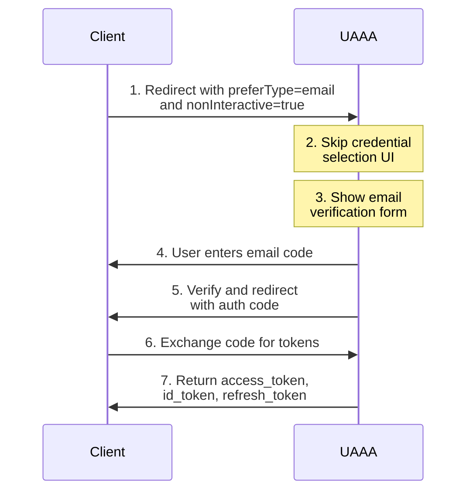

# PreferType + NonInteractive Integration

This guide demonstrates how to integrate applications using `preferType` to specify the preferred credential type and `nonInteractive` mode for streamlined authentication.

## Overview

The `preferType` parameter allows you to:
- Specify preferred credential type (password, email, totp, webauthn, etc.)
- Skip credential selection UI
- Streamline user experience for specific use cases

Combined with `nonInteractive` mode, this creates fast, targeted authentication flows.

## Use Cases

1. **Email-only verification**: Mobile apps with email verification
2. **WebAuthn-first**: Hardware key authentication for high-security apps
3. **TOTP-preferred**: Apps requiring 2FA
4. **Password-only**: Traditional username/password flows

## Flow Diagram



## Parameters

### preferType

Specifies the preferred credential type:

```
preferType=<credential_type>
```

**Supported Types:**
- `password`: Username and password
- `email`: Email OTP
- `sms`: SMS OTP
- `totp`: Time-based OTP (Google Authenticator)
- `webauthn`: WebAuthn/FIDO2 hardware keys
- Custom plugin types (e.g., `iaaa`)

### nonInteractive

Skips UI when possible:

```
nonInteractive=true
```

**Behavior:**
- If user has the preferred credential type → use it directly
- If user doesn't have it → show minimal UI
- Reduces friction for known credential types

### Parameter Encoding

For OAuth2 standard compliance, `preferType`, `nonInteractive`, and `security_level` should be base64-encoded in the `scope` parameter:

```javascript
// 1. Create parameter object
const params = {
  preferType: 'email',
  nonInteractive: true,
  security_level: '2'
}

// 2. Encode as base64
const encoded = Buffer.from(JSON.stringify(params)).toString('base64')
// In browser: btoa(JSON.stringify(params))

// 3. Include in scope parameter
const scope = `openid profile uaaa+param://${encoded}`

// 4. Use in authorization URL
const authUrl = `https://auth.example.com/oauth/authorize?` +
  `client_id=myapp&` +
  `response_type=code&` +
  `redirect_uri=https://myapp.com/callback&` +
  `scope=${encodeURIComponent(scope)}`
```

## Implementation Examples

### Email Verification Flow

Perfect for email-based apps:

```javascript
const express = require('express')
const axios = require('axios')

const config = {
  uaaaIssuer: 'https://auth.example.com',
  clientId: 'myapp.example.com',
  redirectUri: 'https://myapp.example.com/auth/callback'
}

app.get('/auth/login-email', (req, res) => {
  // Encode UAAA-specific parameters in scope
  const uaaaParams = {
    preferType: 'email',
    nonInteractive: true,
    security_level: '2'  // Email is MEDIUM level (2)
  }
  const encodedParams = Buffer.from(JSON.stringify(uaaaParams)).toString('base64')

  const params = new URLSearchParams({
    client_id: config.clientId,
    response_type: 'code',
    redirect_uri: config.redirectUri,
    scope: `openid email uperm://myapp.example.com/** uaaa+param://${encodedParams}`
  })

  res.redirect(`${config.uaaaIssuer}/oauth/authorize?${params}`)
})

app.get('/auth/callback', async (req, res) => {
  const { code } = req.query

  // Exchange code for tokens (same as standard OAuth2)
  const tokenResponse = await axios.post(
    `${config.uaaaIssuer}/oauth/token`,
    new URLSearchParams({
      grant_type: 'authorization_code',
      code: code,
      redirect_uri: config.redirectUri,
      client_id: config.clientId
    })
  )

  const { access_token, id_token } = tokenResponse.data

  // Fetch user email
  const userInfo = await axios.get(
    `${config.uaaaIssuer}/oauth/userinfo`,
    { headers: { Authorization: `Bearer ${access_token}` } }
  )

  // User is now authenticated with verified email
  req.session.user = userInfo.data
  res.redirect('/dashboard')
})
```

### WebAuthn-First Flow

For high-security applications:

```typescript
// src/auth/webauthn-login.ts
interface LoginOptions {
  minSecurityLevel?: number
  requiredClaims?: string[]
}

export async function loginWithWebAuthn(options: LoginOptions = {}) {
  // Encode UAAA-specific parameters in scope
  const uaaaParams = {
    preferType: 'webauthn',
    security_level: '3',  // HIGH level
    nonInteractive: true
  }
  const encodedParams = btoa(JSON.stringify(uaaaParams))

  const params = new URLSearchParams({
    client_id: 'myapp.example.com',
    response_type: 'code',
    redirect_uri: 'https://myapp.example.com/auth/callback',
    scope: `openid profile uperm://myapp.example.com/** uaaa+param://${encodedParams}`
  })

  // Add optional claims
  if (options.requiredClaims) {
    params.append('claims', JSON.stringify({
      userinfo: options.requiredClaims.reduce((acc, claim) => {
        acc[claim] = { essential: true }
        return acc
      }, {} as Record<string, any>)
    }))
  }

  window.location.href = `https://auth.example.com/oauth/authorize?${params}`
}

// Usage
loginWithWebAuthn({
  minSecurityLevel: 3,
  requiredClaims: ['realname', 'email']
})
```

### TOTP-Preferred Flow

For 2FA-enabled apps:

```python
from flask import Flask, redirect, request, session
from urllib.parse import urlencode

app = Flask(__name__)
app.secret_key = 'your-secret'

CONFIG = {
    'uaaa_issuer': 'https://auth.example.com',
    'client_id': 'myapp.example.com',
    'redirect_uri': 'https://myapp.example.com/auth/callback'
}

@app.route('/auth/login-2fa')
def login_2fa():
    """Login preferring TOTP (Google Authenticator)"""
    import json
    import base64

    # Encode UAAA-specific parameters in scope
    uaaa_params = {
        'preferType': 'totp',
        'security_level': '3',  # HIGH level (totp is 3)
        'nonInteractive': True
    }
    encoded_params = base64.b64encode(json.dumps(uaaa_params).encode()).decode()

    params = {
        'client_id': CONFIG['client_id'],
        'response_type': 'code',
        'redirect_uri': CONFIG['redirect_uri'],
        'scope': f"openid profile uperm://myapp.example.com/** uaaa+param://{encoded_params}"
    }

    auth_url = f"{CONFIG['uaaa_issuer']}/oauth/authorize?{urlencode(params)}"
    return redirect(auth_url)

@app.route('/auth/callback')
def callback():
    code = request.args.get('code')
    # Exchange code for tokens...
    return 'Authenticated with TOTP!'
```

### Password-Only Flow

Traditional username/password:

```javascript
// React example
import { useEffect } from 'react'
import { useNavigate, useSearchParams } from 'react-router-dom'

export function LoginPage() {
  const navigate = useNavigate()

  const handleLogin = () => {
    // Encode UAAA-specific parameters in scope
    const uaaaParams = {
      preferType: 'password',
      nonInteractive: true,
      security_level: '2'  // MEDIUM level
    }
    const encodedParams = btoa(JSON.stringify(uaaaParams))

    const params = new URLSearchParams({
      client_id: 'myapp.example.com',
      response_type: 'code',
      redirect_uri: 'https://myapp.example.com/auth/callback',
      scope: `openid profile email uperm://myapp.example.com/** uaaa+param://${encodedParams}`
    })

    window.location.href = `https://auth.example.com/oauth/authorize?${params}`
  }

  return (
    <div>
      <h1>Login</h1>
      <button onClick={handleLogin}>
        Sign in with Password
      </button>
    </div>
  )
}

export function CallbackPage() {
  const [searchParams] = useSearchParams()
  const navigate = useNavigate()

  useEffect(() => {
    const code = searchParams.get('code')
    if (code) {
      exchangeCodeForTokens(code).then(() => {
        navigate('/dashboard')
      })
    }
  }, [searchParams, navigate])

  return <div>Processing login...</div>
}
```

## Combining preferType with Other Parameters

### With Specific User

```javascript
// Encode UAAA-specific parameters in scope
const uaaaParams = {
  preferType: 'email',
  nonInteractive: true
}
const encodedParams = Buffer.from(JSON.stringify(uaaaParams)).toString('base64')

const params = {
  client_id: 'myapp.example.com',
  response_type: 'code',
  redirect_uri: 'https://myapp.example.com/callback',
  scope: `openid email uaaa+param://${encodedParams}`,

  // Pre-fill username (standard OIDC parameter)
  login_hint: 'user@example.com'
}
```

### With Required Permissions

```javascript
// Encode UAAA-specific parameters in scope
const uaaaParams = {
  preferType: 'totp',
  security_level: '3'  // Require HIGH level for write permissions
}
const encodedParams = Buffer.from(JSON.stringify(uaaaParams)).toString('base64')

const params = {
  client_id: 'myapp.example.com',
  response_type: 'code',
  redirect_uri: 'https://myapp.example.com/callback',

  // Request specific permissions
  scope: `openid profile uperm://myapp.example.com/api/read uperm://myapp.example.com/api/write uaaa+param://${encodedParams}`
}
```

### With Security Level Upgrade

```javascript
// User already logged in with LOW level, upgrade to HIGH
const uaaaParams = {
  preferType: 'totp',
  security_level: '3'
}
const encodedParams = Buffer.from(JSON.stringify(uaaaParams)).toString('base64')

const params = {
  client_id: 'myapp.example.com',
  response_type: 'code',
  redirect_uri: 'https://myapp.example.com/callback',
  scope: `uperm://myapp.example.com/admin/** upgradable uaaa+param://${encodedParams}`,

  // Include existing session (standard OIDC parameters)
  prompt: 'none',  // Don't show login if already authenticated
  max_age: '300'   // Require recent authentication (5 min)
}
```

## User Experience Flows

### Scenario 1: User Has Preferred Credential

```
1. User clicks "Login with Email"
2. Redirect to UAAA with preferType=email
3. UAAA detects user has email credential
4. Show email verification form directly (no credential selection)
5. User enters OTP code
6. Redirect back to app with tokens
```

### Scenario 2: User Doesn't Have Preferred Credential

```
1. User clicks "Login with WebAuthn"
2. Redirect to UAAA with preferType=webauthn
3. UAAA detects user doesn't have WebAuthn
4. Show option to:
   a. Register WebAuthn credential
   b. Use alternative credential
5. User chooses and completes authentication
6. Redirect back to app
```

### Scenario 3: New User with PreferType

```
1. New user clicks "Login with Email"
2. Redirect to UAAA with preferType=email
3. UAAA shows registration form with email prominent
4. User registers with email
5. Email verified immediately
6. Redirect back to app with tokens
```

## Security Levels by Credential Type

| Credential | Security Level | preferType Value |
|------------|---------------|-----------------|
| Email OTP | MEDIUM (2) | `email` |
| SMS OTP | HIGH (3) | `sms` |
| Password | MEDIUM (2) | `password` |
| TOTP | HIGH (3) | `totp` |
| WebAuthn | HIGH (3) | `webauthn` |

## Error Handling

```javascript
app.get('/auth/callback', async (req, res) => {
  const { code, error, error_description } = req.query

  if (error) {
    // Handle authentication errors
    switch (error) {
      case 'access_denied':
        // User cancelled or denied access
        return res.redirect('/auth/cancelled')

      case 'credential_unavailable':
        // Preferred credential type not available
        return res.redirect('/auth/login?fallback=true')

      case 'security_level_insufficient':
        // User's credential doesn't meet minSecurityLevel
        return res.redirect('/auth/upgrade-required')

      default:
        console.error(`Auth error: ${error} - ${error_description}`)
        return res.redirect('/auth/error')
    }
  }

  // Continue with token exchange...
})
```

## Best Practices

1. **Fallback Strategy**: Always handle cases where preferred credential isn't available

2. **Clear UI**: Inform users about authentication method before redirecting

3. **Security Level Matching**: Match `security_level` with `preferType`

4. **Progressive Enhancement**: Start with lower security level, upgrade when needed

5. **User Choice**: Provide alternative login methods

## Testing

```javascript
// Test different credential types
describe('PreferType Authentication', () => {
  test('email verification flow', async () => {
    const authUrl = buildAuthUrl({ preferType: 'email' })
    // Simulate user flow...
  })

  test('fallback when credential unavailable', async () => {
    const authUrl = buildAuthUrl({ preferType: 'webauthn' })
    // Test fallback behavior...
  })

  test('security level requirement', async () => {
    const authUrl = buildAuthUrl({
      preferType: 'totp',
      minSecurityLevel: 2
    })
    // Verify security level enforcement...
  })
})
```

## Next Steps

- **[PreAuth Integration](./pre-auth)**: Combine with external identity systems
- **[OAuth2 Integration](./oauth2-oidc)**: Standard OAuth2 flow
- **[Configuration](../configuration)**: Configure credential types
